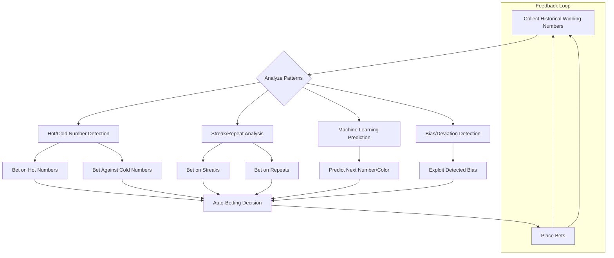

# AI-Driven Auto-Betting Strategies Using Historical Winning Numbers

## Overview
This document outlines advanced auto-betting strategies that leverage historical winning numbers to inform betting decisions. The goal is to move beyond static strategies and use real-time data and pattern recognition for smarter, adaptive betting.

---

## 1. Hot/Cold Number Detection
- **Hot Numbers:** Identify numbers that have appeared more frequently than average in recent history. Bet on these numbers, assuming streaks may continue.
- **Cold Numbers:** Identify numbers that have not appeared for a long time. Bet on these numbers, assuming they are "due" to appear (Gambler's Fallacy approach).
- **Implementation:**
  - Maintain a rolling window of the last N results.
  - Count occurrences for each number.
  - Define thresholds for "hot" and "cold".

## 2. Streak/Repeat Analysis
- **Streaks:** Detect when a number, color, or property (e.g., red/black, odd/even) appears in consecutive rounds.
- **Repeat Bets:** Bet on the continuation or end of a streak (e.g., bet on red if red has appeared 3+ times in a row, or bet on black to break the streak).
- **Implementation:**
  - Track consecutive appearances of numbers/properties.
  - Define rules for when to bet with or against the streak.

## 3. Machine Learning Prediction
- **Pattern Recognition:** Use ML models (e.g., logistic regression, neural networks) trained on historical data to predict the next likely outcome.
- **Feature Engineering:** Use features like last N numbers, streaks, gaps, time of day, etc.
- **Implementation:**
  - Collect a large dataset of historical spins.
  - Train and validate models offline.
  - Deploy model for real-time prediction and betting.

## 4. Bias/Deviation Detection
- **Wheel/Dealer Bias:** Detect if certain numbers or colors appear more often than statistically expected, possibly due to physical bias or software flaws.
- **Exploit Bias:** Increase bet size or frequency on detected biases.
- **Implementation:**
  - Use statistical tests (e.g., chi-squared) to detect deviations from uniform distribution.
  - Alert or auto-bet when significant bias is found.

## 5. Feedback Loop & Adaptation
- **Continuous Learning:** Update strategy parameters based on ongoing results (e.g., adjust hot/cold thresholds, retrain ML models).
- **Stop-Loss/Profit-Taking:** Adapt bet size or pause betting based on session performance.

---

## 6. System Flow Diagram

Below is a conceptual flowchart of the AI-driven auto-betting process:

---

## 7. Next Steps
- Choose one or more strategies to prototype.
- Integrate historical number tracking with the betting engine.
- Optionally, develop a simple ML model for prediction.
- Add UI controls to enable/disable and configure these strategies. 